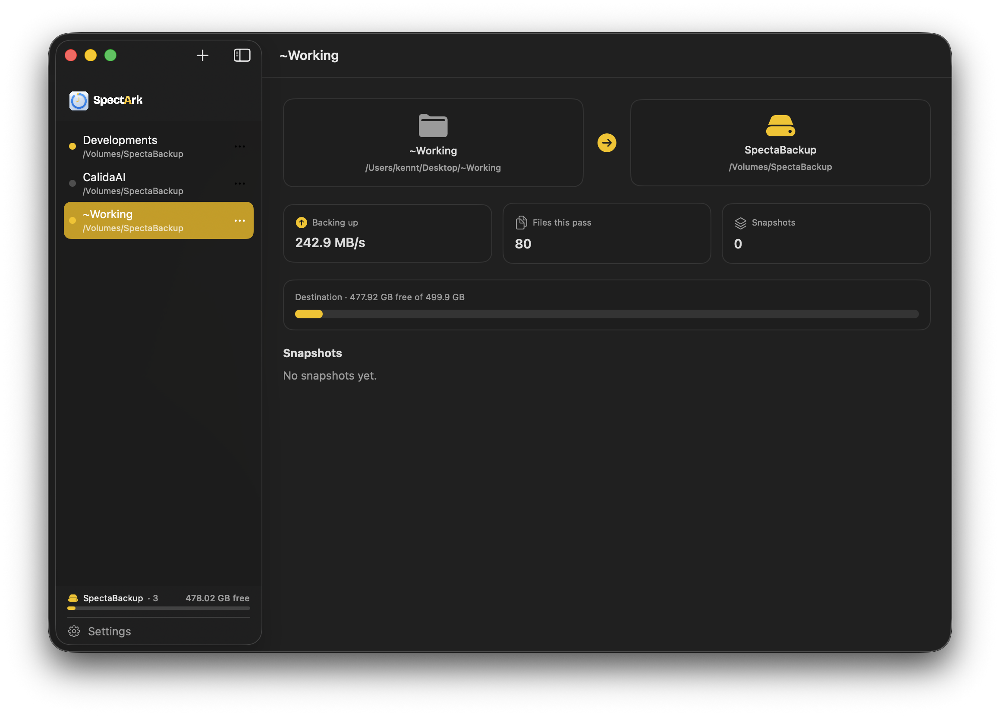

# SpectArk



A native macOS incremental backup app (Calida Lab / Specta product family).

## Why SpectArk?

I love Time Machine's versioned, point-in-time approach — but as a developer, the way
it works wasn't what I needed:

- **I don't need a whole-system backup.** Time Machine copies the OS, apps, and
  Libraries. If my machine dies I'll just reinstall those. What I *can't* reinstall is
  the thing that actually matters: my source code and the projects I'm working on.
- **Scheduled backups always leave a gap.** A long interval risks losing my latest
  code; a short one still loses whatever changed in the last few minutes when Murphy's
  law strikes. Even Git only protects what I've committed — never the work *between*
  commits.
- **So I wanted a backup that fires the instant my code changes.** Point SpectArk at
  the folder I'm actively developing in and it snapshots the moment a file changes — no
  schedule, no gap. That realtime behavior is the whole reason this app exists.
- **And I didn't want to sacrifice a whole drive to it.** Dedicating an entire disk to
  backups felt wasteful. I wanted to choose exactly where snapshots live and pair any
  source folder with any destination, freely.

SpectArk is the result: realtime, folder-scoped, versioned backup that protects the
files you actually care about — and lets you decide where they go.

## Features

- **Versioned snapshots** (Time Machine style): point-in-time snapshots, unchanged
  data shared via APFS clones / hardlinks.
- **Realtime or scheduled** per backup — watch a folder live (FSEvents) and snapshot on
  change, or run on an interval.
- **Multiple source folders**, each paired with any destination you choose.
- **Local disk or NAS** destinations, with strategy auto-detected per destination.
- **Optional encryption**: content-defined chunking + dedup, AES-256-GCM with
  argon2id-derived keys, and a one-time recovery key. Off by default (snapshots
  stay browsable plaintext).
- **Dashboard window + menu-bar dropdown** (live throughput, free space, last backup).
- Non-sandboxed, Developer ID distribution. macOS 14+.

## Build

The Xcode project is generated with [XcodeGen](https://github.com/yonki/XcodeGen):

```sh
brew install xcodegen      # one-time
xcodegen generate          # produces SpectaBackup.xcodeproj
open SpectaBackup.xcodeproj
```

Or from the command line:

```sh
xcodegen generate
xcodebuild -project SpectaBackup.xcodeproj -scheme SpectaBackup -configuration Release build
```

`SpectaBackup.xcodeproj` is generated and git-ignored; `project.yml` is the source of
truth. The project and scheme keep the legacy `SpectaBackup` name (and the bundle id
`ai.calidalab.spectabackup`) so existing backups, Keychain entries, and Full Disk
Access carry over across the rename; the built app is `SpectArk.app`.

## Data integrity

The backup engine is built on macOS primitives chosen for correctness:
APFS source snapshots (consistent reads), `clonefile`/`copyfile`, atomic
`rename` publish with a `COMPLETE` marker, and a SQLite catalog with
`F_FULLFSYNC` durability. See [`docs/ENCRYPTION_DESIGN.md`](docs/ENCRYPTION_DESIGN.md)
for the encrypted-repo design.
